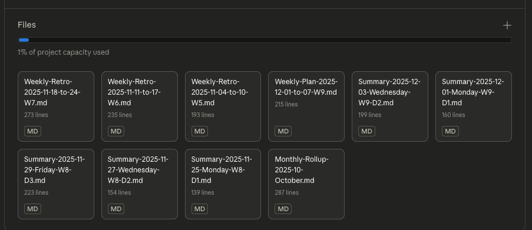

# My Journey

Started with a Google Doc. Daily logs - work, exercise, sleep.

Then conversations with Claude. Copy/paste summaries every day.

Then Projects. Documents persist! But wasting tokens...

Then Skills. Instructions loaded only when needed.

Each step: less friction, more insight.

---

# The Goal

I wanted to build better habits.

Exercise more. Sleep better. Ship more code.

Tried apps. Tried spreadsheets. Tried journaling.

What I really wanted: someone to talk to about my day
who remembered yesterday.

---

# What if you could just... talk to it?

A flexible system that remembers yesterday.

And last week. And your goals.

No agents to build. No RAG to configure.

Just conversations that accumulate context.

---

# {.center}

## Evolution

How the system developed

---

# Evolution v1-v2: The Search

**v1: Giant Google Doc**
- Daily logging: work, exercise, sleep, diet
- Gaining insights = manual effort or build systems
- Too much cognitive load sifting through it all

**v2: Journaling Agents**
- Various attempts at building agents
- Create summary → copy/paste into new chat
- Repeat daily. Forever.

---

# Evolution v3: The Aha Moment

**Projects + saving to documents**

But I was wasting tokens:

```
┌─────────────────────────────────────┐
│ Project Context (always loaded)     │
│ ┌─────────┐ ┌─────────┐ ┌─────────┐│
│ │Summary-1│ │Summary-2│ │Summary-3││
│ └─────────┘ └─────────┘ └─────────┘│
│ ┌─────────────────────────────────┐│
│ │ instructions.md (5k tokens)     ││ ← Always here
│ └─────────────────────────────────┘│
└─────────────────────────────────────┘
         +
   "Please read Summary-1"  ← Wasted! Already in context
```

---

# Evolution v4-v5: The Pattern

**v4: Skills = on-demand instructions**
- Retro instructions only loaded during retro
- Not burning tokens every conversation

**v5: Skill inheritance**
- What's structural? (shareable)
- What's personal? (private)
- `claude-as-coach` + `claude-as-coach-personal`

No grand plan. Just iterated on friction.

---

# {.center}

## The Platform

Claude.ai Projects + Skills

---

# Projects: The Mental Model

::: notes
SWITCH TO: Empty Claude.ai project, then one with documents
SHOW: Project sidebar with documents
:::



Every conversation sees **all** project documents.

---

# Project Primitives

| Primitive | What it is | How I use it |
|-----------|------------|--------------|
| **Conversation** | Permanent chat, context not retained | Daily check-ins |
| **Artifact** | Generated content | Summaries, retros |
| **File** | Project document | Persistent context |
| **Memory** | Cross-project recall | (optional - skipped) |
| **Instructions** | System prompt | (skipped to simplify) |

The workflow uses **conversations → artifacts → files**.

---

# The System: Daily → Weekly Loop

```
        ┌──────────────┐
   ┌───►│ Morning "gm" │  ← conversation only
   │    └──────┬───────┘
   │           ▼
   │    ┌──────────────┐
   │    │Daily Summary │──────┐
   │    └──────────────┘      │ x7
   │                          ▼         artifacts →
   │    ┌──────────────┐    ┌──────────────┐  project docs
   │    │ Weekly Plan  │◄───│ Weekly Retro │
   │    └──────┬───────┘    └──────────────┘
   │           │
   └───────────┘
```

---

# Conversations → Artifacts → Documents

```
┌─────────────────────────────────────────────────┐
│ Conversation (saved, but not revisited)         │
│ "How was your run today?"                       │
│ "Great! Did 2.5 miles, no walk breaks..."       │
│                    │                            │
│                    ▼                            │
│ ┌─────────────────────────────────────────────┐ │
│ │ Artifact (generated)                        │ │
│ │ Summary-2025-12-11-Wednesday.md             │ │
│ └─────────────────────────────────────────────┘ │
└─────────────────────────────────────────────────┘
                     │
                     ▼ "Add to project"
┌─────────────────────────────────────────────────┐
│ Project Document (persistent)                   │
│ Available in ALL future conversations           │
└─────────────────────────────────────────────────┘
```

---

# Fractal Compression

```
Sun Mon Tue Wed Thu Fri Sat
 │   │   │   │   │   │   │
 └───┴───┴───┼───┴───┴───┘
             ▼
      Weekly Retro (1 doc)
```

```
Week 1 ─┐
Week 2 ─┼──► Monthly Retro (1 doc)
Week 3 ─┤
Week 4 ─┘
```

**Manual workflow:** Download retro → add to project → remove rolled-up docs

---

# {.center}

## Skills

On-demand instructions for Claude

---

# What's a Skill? (Basic)

::: notes
SWITCH TO: Show daily-summary-base/SKILL.md in repo
:::

A `.zip` containing markdown instructions.

```
daily-summary-base/
└── SKILL.md
```

```yaml
---
name: daily-summary-base
description: Use when user says "daily summary"
             or "end of day"
---

# Daily Summary Generator

## Process
1. Verify current date (bash command)
2. Ask which date to summarize
3. Generate structured markdown...
```

---

# What's a Skill? (With Tools)

Skills can bundle Python scripts.

```
skill-creator/
├── SKILL.md              # LLM instructions
└── scripts/
    ├── init_skill.py
    ├── package_skill.py
    └── quick_validate.py
```

**The blend:**
- Instructions tell Claude *what* to do and *when*
- Scripts give Claude *deterministic tools* to call
- LLM handles ambiguity, scripts handle precision

---

# Code is Data is Code

A skill is a function that runs on an LLM.

```
Input:  User says "daily summary"
        + Project documents (context)

Compute: LLM executes skill instructions
         Calls tools as needed

Output: Summary-2025-12-11-Wednesday.md
```

The instructions *are* the program.
The context *is* the state.
The LLM *is* the runtime.

---

# The .zip/.skill Confusion

::: notes
Links showing the inconsistency:
- https://www.anthropic.com/engineering/equipping-agents-for-the-real-world-with-agent-skills
- https://platform.claude.com/docs/en/agents-and-tools/agent-skills/overview
- https://support.claude.com/en/articles/12512198-how-to-create-custom-skills
- https://github.com/anthropics/skills/blob/main/skills/skill-creator/SKILL.md
- https://github.com/anthropics/skills/blob/main/skills/skill-creator/scripts/package_skill.py#L64
:::

Most Anthropic docs say `.zip`

But `skill-creator` tool outputs `.skill`

```bash
# skill-creator outputs:
python package_skill.py daily-summary-base/
# → daily-summary-base.skill  # Won't upload!

# Workaround:
mv daily-summary-base.skill daily-summary-base.zip
```

PR pending to fix their tooling.

---

# Projects vs Claude Code

| Claude.ai Projects | Claude Code |
|--------------------|-------------|
| Cross-device (phone + laptop) | Terminal-focused |
| Document-centric | Code-centric |
| "Log my run" from phone | "Fix this bug" from IDE |
| Context = your documents | Context = your codebase |
| Skills in Settings | Skills in repo |

**Different tools, different jobs.**

---

# {.center}

## Demo

Rob the Runner in action

---

# Demo Time: Rob the Runner

**Who:** 39-year-old accountant, first-time runner

**Where:** Week 8 of Couch-to-5K (almost done!)

**Today:** Sunday morning. Planning his final push week.

We'll see the full loop: setup → morning → summary → retro → plan

---

# Demo 0: Project Setup

::: notes
SWITCH TO: Project "rob-setup" or fresh project
SHOW: Running project-coach-setup skill
POINT OUT: Goal definition, context gathering
:::

**Trigger:** "let's set up this project" or import setup skill

- Define your goal and time horizon
- Establish tracking metrics
- Set initial context (what's your starting point?)

This only happens once per project.

---

# Demo 1: Morning Routine

::: notes
SWITCH TO: Project "rob-morning"
SHOW: The "gm" command and response
POINT OUT: How it found yesterday's summary
:::

**Trigger:** "gm" or "good morning"

- Verifies today's date
- Finds yesterday's summary
- Generates scannable morning brief

---

# Demo 2: Daily Summary

::: notes
SWITCH TO: Project "rob-daily-summary"
SHOW: Completed summary artifact
POINT OUT: Key Numbers table, TL;DR section
:::

**Trigger:** "daily summary"

- Guided conversation about the day
- Structured output with sections
- Saves to project for tomorrow

---

# Daily Summary: The Output

```markdown
# Wednesday, Dec 11, 2025 - Daily Summary

**GROUND TRUTH:**
- Date: Wednesday, December 11, 2025
- W8-D3 (Week 8, Day 3 of C25K)

## TL;DR
Solid 2.5mi run, felt strong. First time
finishing without walk breaks.

## Key Numbers
| Metric | Value | Notes |
|--------|-------|-------|
| Distance | 2.5 mi | No walk breaks! |
| Pace | 11:30/mi | PR for continuous |
```

---

# Demo 3: Weekly Retrospective

::: notes
SWITCH TO: Project "rob-weekly-retro"
SHOW: Retro pulling from daily summaries
POINT OUT: "What Worked / What Didn't Work" structure
:::

**Trigger:** "weekly retro"

- Reviews 7 daily summaries
- Extracts patterns
- Identifies experiments to run

---

# Weekly Retro: Compression in Action

```
Input: 7 daily summaries (~3500 words)
       ↓
Output: 1 weekly retro (~800 words)

What Worked:
- Morning runs before work
- 10-min warmup routine

What Didn't Work:
- Evening runs (too tired)
- Skipping rest days

Experiments for Next Week:
- Try 5-min post-run stretching
```

---

# Demo 4: Weekly Planning

::: notes
SWITCH TO: Project "rob-weekly-plan"
SHOW: Plan with success levels
POINT OUT: L0-L3 framework
:::

**Trigger:** "weekly planning"

- Reviews previous retro
- Sets priorities with constraints
- Defines success levels

---

# The L0-L3 Success Framework

```
L0 (Minimum): Complete 3 scheduled runs
              "The week isn't a failure"

L1 (Target):  3 runs + all rest day stretching
              "A good week"

L2 (Stretch): L1 + one extra distance run
              "Exceeded expectations"

L3 (Exceptional): Hit 5K distance milestone
                  "Breakthrough week"
```

This framework emerged over time. Works for me - YMMV.

---

# {.center}

## Architecture

How the pieces fit together

---

# Repo Structure

::: notes
SWITCH TO: Terminal or VS Code showing repo
:::

```
claude-as-coach-combined/          # Parent workspace
├── claude-as-coach/               # Public (shareable)
│   ├── skills/                    # Base skill frameworks
│   ├── examples/rob-the-runner/   # Demo persona
│   └── scripts/
└── claude-as-coach-personal/      # Private (your data)
    ├── skills/                    # Your extensions
    └── documents/                 # Your summaries
```

---

# Base + Personal Skill Pattern

```
┌────────────────────────────────────┐
│ daily-summary-base.zip             │
│ (Generic framework - shareable)    │
│ - Date verification                │
│ - Section structure                │
└────────────────────────────────────┘
              +
┌────────────────────────────────────┐
│ daily-summary-personal.zip         │
│ (Your customizations - private)    │
│ - Your metrics (pace, HR, sleep)   │
│ - Your thresholds                  │
└────────────────────────────────────┘
```

Import both. Claude loads both at runtime.

---

# {.center}

## Lessons

What actually matters

---

# What I Learned

1. **Skills are prompts** - just better organized
2. **Context management is the game** - not agent architecture
3. **Low-build wins** - I'm still using this daily
4. **Personal data stays personal** - base/personal split works

---

# Platform Limitations (Real Talk)

- Skills are **global** (not project-scoped)
- Can't programmatically manage skills
- Mobile upload is clunky
- Context limits exist (Pro vs Max)

Works despite these. Not because of them.

---

# {.center}

## What's Next

Open source and beyond

---

# Where This Is Going

**Open Source (now)**

- MIT license
- Base skills shareable
- Rob example included

**Microagent (future)**

- Same pattern, any model
- Tool-calling models (Llama, Qwen, etc.)
- Not locked to Claude

---

# Try It Yourself

**Easiest:** Paste `bootstrap-skill-creator.md` into Claude

(Auto-fetches skills + runs project setup)

**Or manually:** Download .zip files from repo

```
skills/
├── project-coach-setup-base.zip  ← Start here
├── daily-summary-base.zip
├── daily-morning-routine-base.zip
├── planning-base.zip
└── retrospective-base.zip
```

See `docs/experiments/` for alternative onboarding approaches.

---

# LLMs Are Bad at Dates

Every skill that deals with dates starts with this:

```bash
TZ='America/New_York' date '+%A, %B %d, %Y'
```

LLMs make up dates. Tool calls give ground truth.

No assumptions. Verify first.

---

# Skills Are Global (Pain Point)

Platform limitation: Skills not project-scoped

**The problem:**
- My account is both prod AND dev
- Manual toggle to test changes
- No "dev skill" vs "prod skill" per project

**Workaround:**
- Naming: `production-*` vs `development-*`
- Manual toggling in Settings > Capabilities

---

# Onboarding Experiments

```
docs/experiments/onboarding-approaches/
├── bootstrap-simple.md      # Minimal setup
├── bootstrap-complex.md     # Full walkthrough
├── bootstrap-skill-creator.md  # Auto-fetch skills
└── README.md
```

Testing which path works best for new users.

Git tracks the experiments. Claude Code helps iterate.

---

# Safety Boundaries

This is a **reflection tool**, not a replacement for:

- Medical advice
- Mental health support
- Financial guidance
- Legal counsel

Claude has limitations. Critical decisions need professionals.

(Disclaimers added to README, skills, and setup docs)

---

# The Dev Process

"Zero build" doesn't mean zero iteration.

**Primitives explored:**
- Conversation (ephemeral)
- Artifact (generated)
- Project document (persistent)
- Memory (skipped - adds complexity)
- Instructions (skipped - harder to git track)

**Insight:** Project docs > base instructions for git tracking

---

# The Bitter Lesson

Why over-engineer when context windows keep growing?

| Approach | Friction |
|----------|----------|
| RAG pipeline | High (infra, embeddings, retrieval) |
| Custom agent | Medium (code, testing, deployment) |
| Summary-of-summaries | Low (just documents) |

Context stays in documents. Claude reads them all.

Like memory that decays naturally over time.

---

# The Pitch

You're AI engineers. You could build this with:

- LangChain
- Custom agents
- RAG pipelines
- Vector databases

Or you could just... use Claude Projects with some markdown files.

**Sometimes the best agent is no agent.**

---

# Summary + Questions

| Concept | Key Point |
|---------|-----------|
| **Projects** | Documents always in context |
| **Skills** | On-demand instructions (.zip) |
| **Base + Personal** | Shareable framework + private data |
| **Fractal Compression** | Daily → Weekly → Monthly |
| **The Loop** | Morning → Summary → Retro → Plan |

**Repo:** github.com/ZachBeta/claude-as-coach

**Triggers:** "gm" · "daily summary" · "weekly retro" · "weekly planning"

---

# Appendix: Skill Triggers

| Skill | Triggers |
|-------|----------|
| Morning Routine | "gm", "good morning" |
| Daily Summary | "daily summary", "end of day" |
| Weekly Retro | "weekly retro" |
| Weekly Planning | "weekly planning" |

---

# Appendix: Key Files

| File | Purpose |
|------|---------|
| `QUICKSTART.md` | 5-minute setup |
| `PROJECT-SETUP.md` | Comprehensive guide |
| `skills/*/SKILL.md` | Skill source files |
| `scripts/skill_workflow.py` | Pack/unpack utility |
